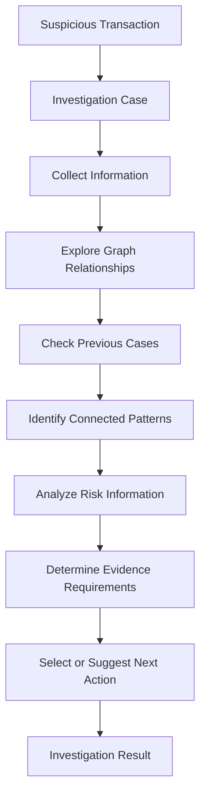
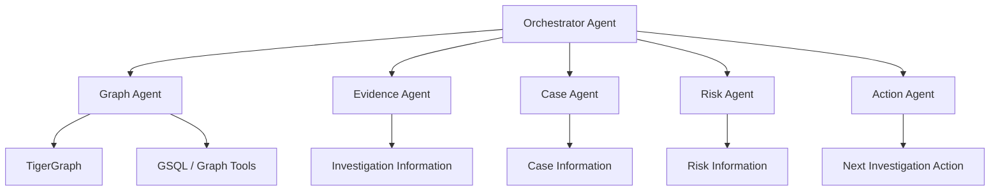
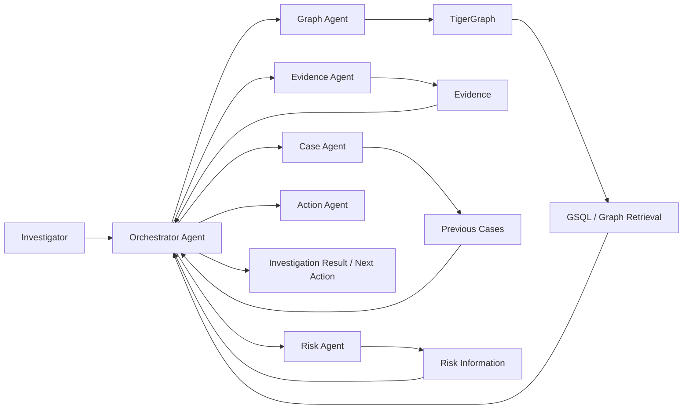

# Agentic Fraud Investigation using TigerGraph

> **Connecting graph relationships, AI agents, and investigation evidence to support structured fraud analysis.**

An agentic, graph-based fraud investigation system built around **TigerGraph**, **AI Agents**, **GraphRAG**, **GSQL**, **Python**, and **pyTigerGraph**. The project focuses on investigating suspicious financial transactions by exploring relationships between entities, examining supporting information, and organizing investigation steps into a structured workflow.

---

## Table of Contents

* [Project Overview](#project-overview)
* [Problem Statement](#problem-statement)
* [Proposed Solution](#proposed-solution)
* [Key Features](#key-features)
* [How the System Works](#how-the-system-works)
* [Investigation Workflow](#investigation-workflow)
* [AI Agent Architecture](#ai-agent-architecture)
* [System Architecture](#system-architecture)
* [TigerGraph Integration](#tigergraph-integration)
* [Data Model / Graph Schema](#data-model--graph-schema)
* [Illustrative Investigation](#illustrative-investigation)
* [Technology Stack](#technology-stack)
* [Architecture Diagram](#architecture-diagram)
* [Challenges and Learnings](#challenges-and-learnings)
* [Responsible Use](#responsible-use)
* [Future Scope](#future-scope)
* [Team](#team)
* [Project Demonstration](#project-demonstration)
* [Project Structure](#project-structure)
* [License](#license)

---

## Project Overview

Financial fraud investigation often involves more than identifying a suspicious transaction.

A transaction may be connected to a **customer, card, device, other transactions, previous cases, and supporting evidence**. Looking at each record independently can make it difficult to understand the wider context surrounding an alert.

This project explores a different approach: representing relevant information as a **graph** and using **AI agents** to support different stages of an investigation.

TigerGraph provides the graph-oriented data layer, while the agentic layer coordinates investigation tasks such as relationship exploration, case analysis, evidence-oriented reasoning, risk-related analysis, and next-action selection.

The core idea is:

```text
Suspicious Transaction
        ↓
Investigation Case
        ↓
Connected Data
        ↓
Graph Relationships
        ↓
Evidence & Previous Cases
        ↓
Agent-Based Investigation
        ↓
Investigation Result / Next Action
```

The system is designed as an **investigation and decision-support tool**, rather than an unquestionable final decision-maker.

---

# Problem Statement

Fraud investigations can involve large amounts of connected information.

A suspicious transaction may have relationships with:

* Customers
* Cards
* Devices
* Other transactions
* Previous investigation cases
* Evidence
* Risk-related information
* Investigation actions

A risk score or alert can indicate that something requires attention, but it does not necessarily provide the complete relationship context behind that alert.

Investigators may therefore need to examine multiple connected records and information sources to understand:

> **What is connected to this transaction, what evidence is available, what previous information is relevant, and what should be investigated next?**

This project focuses on using graph-based investigation to make those relationships easier to explore and combine with agent-assisted reasoning.

---

# Proposed Solution

The proposed solution is an:

## **Agentic, Graph-Based Fraud Investigation System powered by TigerGraph**

The investigation workflow is organized around several stages:

1. Identify a suspicious transaction.
2. Create an investigation case.
3. Collect relevant information.
4. Explore connected entities and relationships.
5. Examine previous cases and related information.
6. Identify connected patterns.
7. Analyze risk-related information.
8. Determine whether additional evidence is required.
9. Select or suggest an appropriate next investigation action.
10. Store the investigation result when supported by the implementation.

Instead of requiring one AI agent to handle every responsibility, the architecture separates investigation responsibilities across specialized agents.

---

# Key Features

| Feature                                  | Description                                                                                   |
| ---------------------------------------- | --------------------------------------------------------------------------------------------- |
| **Graph-Based Relationship Analysis**    | Explore relationships between entities involved in an investigation.                          |
| **Suspicious Transaction Investigation** | Organize investigation around suspicious financial activity.                                  |
| **AI Agent-Based Investigation**         | Divide investigation responsibilities across specialized AI agents.                           |
| **Entity Relationship Exploration**      | Explore connections between customers, cards, transactions, devices, and related information. |
| **Previous Case Analysis**               | Use relevant historical case information as investigation context.                            |
| **Evidence-Oriented Investigation**      | Consider available evidence and determine whether additional evidence may be required.        |
| **Risk-Related Analysis**                | Analyze risk-related information as part of the investigation workflow.                       |
| **Next Action Support**                  | Identify or suggest the next investigation action.                                            |
| **GraphRAG**                             | Support graph-oriented information retrieval where implemented.                               |
| **GSQL**                                 | Query and work with graph data where implemented.                                             |
| **Python + pyTigerGraph**                | Connect application logic with TigerGraph.                                                    |
| **Investigation Workflow Tracking**      | Organize the investigation through defined stages.                                            |

---

# How the System Works

```text
Suspicious Transaction
        ↓
Create Investigation Case
        ↓
Collect Relevant Information
        ↓
Explore Graph Relationships
        ↓
Check Previous Cases
        ↓
Identify Connected Patterns
        ↓
Analyze Risk-Related Information
        ↓
Determine Evidence Requirements
        ↓
Select / Suggest Next Action
        ↓
Store Investigation Result
```

### 1. Suspicious Transaction

An investigation begins with a transaction or alert requiring further examination.

### 2. Create Investigation Case

The suspicious activity is associated with an investigation case so that investigation information can be organized around a specific incident.

### 3. Collect Relevant Information

Relevant entities and information associated with the case are gathered for investigation.

### 4. Explore Graph Relationships

TigerGraph represents connected entities and relationships as a graph, allowing the investigation to move beyond an isolated transaction record.

### 5. Check Previous Cases

Relevant previous case information can provide additional context during an investigation.

### 6. Identify Connected Patterns

Relationships between transactions, customers, cards, devices, and other entities can be examined to identify potentially relevant connections.

### 7. Analyze Risk-Related Information

Risk-related information is considered as part of the investigation rather than being treated as the complete investigation result.

### 8. Determine Evidence Requirements

The investigation can determine whether additional information or evidence is needed.

### 9. Select / Suggest Next Action

The system can identify or recommend the next investigation action according to the investigation workflow.

### 10. Store Investigation Result

Investigation results or case information can be retained for further use where supported by the implementation.

---

# Investigation Workflow

The project treats fraud investigation as a connected workflow rather than an isolated transaction lookup.



### Core Investigation Entities

| Entity                   | Role                                                     |
| ------------------------ | -------------------------------------------------------- |
| **Customer**             | Person or entity associated with transaction activity    |
| **Card**                 | Payment instrument associated with transactions          |
| **Device**               | Device-related information connected to activity         |
| **Transaction**          | Financial activity being investigated                    |
| **Investigation Case**   | Container for investigation information                  |
| **Previous Case**        | Historical investigation information                     |
| **Evidence**             | Information supporting investigation reasoning           |
| **Risk Information**     | Information used during risk-related analysis            |
| **Investigation Action** | Next step selected or suggested during investigation     |
| **Final Case Result**    | Result produced at the end of the investigation workflow |

The graph allows the system to explore relationships instead of examining each record in isolation.

---

# AI Agent Architecture

The project uses specialized investigation responsibilities rather than placing every task inside a single agent.

## 1. Orchestrator Agent

Coordinates the investigation workflow and manages communication between the different investigation agents.

**Primary responsibility:**

* Coordinate investigation tasks
* Manage the overall workflow
* Route tasks to relevant agents

---

## 2. Graph Agent

Works with graph-based information and explores relationships relevant to an investigation.

**Primary responsibility:**

* Explore connected entities
* Retrieve graph-related information
* Work with TigerGraph and graph queries

---

## 3. Evidence Agent

Supports the identification and evaluation of investigation-relevant evidence.

**Primary responsibility:**

* Identify relevant evidence
* Examine available investigation information
* Support evidence-oriented reasoning

---

## 4. Case Agent

Handles investigation case information and relevant historical case context.

**Primary responsibility:**

* Work with investigation cases
* Examine previous case information
* Provide case-related context

---

## 5. Risk Agent

Examines risk-related information and suspicious patterns as part of the investigation.

**Primary responsibility:**

* Analyze risk-related information
* Examine suspicious patterns
* Contribute risk context to the investigation

---

## 6. Action Agent

Supports selection of the next investigation action.

**Primary responsibility:**

* Determine the next investigation step
* Recommend or execute an action according to the implemented workflow

---

### Agent Architecture



---

# System Architecture

The overall system can be viewed through several logical layers.

```text
┌─────────────────────────────────────┐
│         User / Investigator         │
└──────────────────┬──────────────────┘
                   │
                   ▼
┌─────────────────────────────────────┐
│       Frontend / Application        │
└──────────────────┬──────────────────┘
                   │
                   ▼
┌─────────────────────────────────────┐
│      AI Agent Orchestration         │
└──────────────────┬──────────────────┘
                   │
                   ▼
┌─────────────────────────────────────┐
│       Investigation Agents          │
│ Graph │ Evidence │ Case │ Risk │    │
│              Action                 │
└──────────────────┬──────────────────┘
                   │
                   ▼
┌─────────────────────────────────────┐
│       Tools & Integrations          │
│ GSQL │ Python │ pyTigerGraph │      │
│ GraphRAG │ MCP                      │
└──────────────────┬──────────────────┘
                   │
                   ▼
┌─────────────────────────────────────┐
│            TigerGraph               │
│     Entities + Relationships         │
└─────────────────────────────────────┘
```

---

# TigerGraph Integration

TigerGraph is central to the project's graph-based investigation approach.

Instead of treating every transaction as an isolated record, graph representation allows related entities and their connections to be explored together.

The project focuses on relationships such as:

```text
Customer
   │
   ├── Card
   │     │
   │     └── Transaction
   │
   ├── Device
   │
   └── Previous Case
```

This representation allows an investigation to follow connections between entities and examine the context surrounding suspicious activity.

## TigerGraph Components

| Component        | Purpose                                        |
| ---------------- | ---------------------------------------------- |
| **TigerGraph**   | Graph database and relationship representation |
| **GSQL**         | Graph query capability                         |
| **Python**       | Application and investigation logic            |
| **pyTigerGraph** | Python-to-TigerGraph integration               |
| **GraphRAG**     | Graph-oriented retrieval                       |
| **MCP**          | Tool integration                               |

---

# Data Model / Graph Schema

The investigation model contains the following major entities:

| Entity / Vertex        | Purpose                                         |
| ---------------------- | ----------------------------------------------- |
| **Customer**           | Represents customer-related information         |
| **Card**               | Represents card/payment-instrument information  |
| **Transaction**        | Represents financial transaction activity       |
| **Device**             | Represents device-related information           |
| **Investigation Case** | Represents an investigation                     |
| **Evidence**           | Represents investigation-supporting information |
| **Previous Case**      | Represents historical case information          |

### Relationships

The graph connects relevant entities so that investigations can follow relationships rather than treating records independently.

```text
Customer ─────── Card
    │              │
    │              │
    └── Device     └──── Transaction
                       │
                       │
                       └──── Previous Case
```

---

# Illustrative Investigation

> **Illustrative Example — Not Actual Production Data**

Consider a suspicious transaction requiring further investigation.

### Step 1 — Investigation Trigger

A suspicious transaction enters the investigation workflow.

### Step 2 — Case Creation

An investigation case is created for the transaction.

### Step 3 — Graph Exploration

The investigation explores relationships involving:

* Customer
* Card
* Device
* Related transactions
* Previous cases

### Step 4 — Previous Case Analysis

Relevant historical case information is examined.

### Step 5 — Agent Investigation

Specialized agents contribute to different parts of the investigation, including graph exploration, evidence analysis, risk analysis, and next-action selection.

### Step 6 — Evidence Requirements

The investigation considers whether the currently available information is sufficient or whether additional evidence is required.

### Step 7 — Next Action

The system identifies or recommends the next investigation action according to the workflow.

### Step 8 — Investigation Result

The investigation produces a structured result for the case.

---

# Technology Stack

| Category                   | Technology      | Purpose                                  |
| -------------------------- | --------------- | ---------------------------------------- |
| **Graph Database**         | TigerGraph      | Graph data and relationship analysis     |
| **Query Language**         | GSQL            | Graph queries                            |
| **Programming Language**   | Python          | Application and integration logic        |
| **TigerGraph Integration** | pyTigerGraph    | Python–TigerGraph connection             |
| **AI**                     | AI Agents / LLM | Investigation coordination and reasoning |
| **Retrieval**              | GraphRAG        | Graph-based information retrieval        |
| **Tool Integration**       | MCP             | Tool and agent integration               |

---

# Architecture Diagram



---

# Challenges and Learnings

## Graph Schema Design

A useful investigation graph requires meaningful entities and relationships.

The schema needs to represent enough context for investigations while keeping the graph understandable and useful.

**Learning:** The graph model should be designed around the investigation questions the system needs to answer.

---

## Dataset Preparation

Investigation workflows depend on structured and connected information.

Preparing transaction and related entity information for graph storage requires careful mapping between source data and graph entities.

**Learning:** Data preparation is an important part of building a useful graph-based investigation system.

---

## Python–TigerGraph Integration

Connecting application logic with the graph database requires reliable communication between Python components and TigerGraph.

**Learning:** Database integration should remain clearly separated from the investigation logic.

---

## GSQL Development

Graph queries need to retrieve the relationships required by the investigation.

**Learning:** Query design should follow investigation requirements rather than retrieving graph data without a specific purpose.

---

## Multi-Agent Coordination

Multiple agents introduce additional complexity because different responsibilities must work together consistently.

**Learning:** Agent responsibilities should remain clearly defined, with an orchestration layer controlling the overall workflow.

---

## Evidence-Based Reasoning

AI-generated reasoning can produce unsupported conclusions if it is not grounded in available information.

**Learning:** Investigation reasoning should remain connected to available evidence and should be reviewed against the underlying data.

---

# Responsible Use

This project is intended for:

* Fraud investigation support
* Research and experimentation
* Graph-based analysis
* Evidence-oriented investigation workflows
* Decision support for authorized users

The system should be treated as a **decision-support and investigation tool**, not as an unquestionable final authority.

### Responsible-use principles

* Investigation results should be reviewed by authorized human investigators where appropriate.
* Sensitive financial and personal information should be handled securely.
* Demonstration datasets should not expose real personal or financial information.
* AI-generated reasoning should be verified against available evidence.
* The system should not be used for unauthorized surveillance.
* The system should not be used to make discriminatory or harmful decisions.

---

# Future Scope

The following improvements represent potential future development directions:

### Real-Time Investigation

Support investigation workflows where relevant transaction information can be processed closer to real time.

### Graph Algorithms

Explore graph algorithms for relationship and pattern analysis.

### Temporal Relationship Analysis

Add time-aware analysis to understand how relationships and transaction activity evolve.

### Improved Case Memory

Develop stronger mechanisms for using relevant historical investigation information.

### Advanced GraphRAG

Improve graph-based retrieval and grounding of agent reasoning.

### Advanced Evidence Analysis

Expand the ability to organize and evaluate investigation evidence.

### Human-in-the-Loop Investigation

Provide explicit points where authorized investigators can review and approve investigation actions.

### Improved Agent Coordination

Improve communication, task allocation, and consistency between specialized agents.

### Additional Fraud Patterns

Expand the range of patterns that can be examined during investigations.

### Scalable Deployment

Explore deployment approaches suitable for larger investigation workloads.

---

# Team

Our team consists of three members with responsibilities spanning leadership, development, database management, UI/UX, testing, and documentation.

| Team Member          | Role                                  | Responsibilities                                                                          |
| -------------------- | ------------------------------------- | ----------------------------------------------------------------------------------------- |
| **Pritha Pal**       | Team Leader, Tester/QA, Documentation | Team coordination, quality assurance, testing, and project documentation                  |
| **Aman Kumar Singh** | Backend Developer, Database Manager   | Backend development, TigerGraph integration, database management, and investigation logic |
| **Aayush Jha**       | Frontend Developer, UI/UX Designer    | Frontend development, user interface design, and user experience                          |


---

# Project Demonstration

### (https://drive.google.com/drive/folders/1unPR3prVp_2O-hYqtIjmtmnDU1viu1Ko)

<span style="color:red"></span>

### Screenshots

<span style="color:red">


</span>


---

# Project Structure

```text
project-root/
|
|-- agent/                  # Core AI Agent Logic
|   |-- agents/             # Individual agent definitions (Policy Agent, etc.)
|   |-- strict_eleven_pipeline.py # 11-Agent zero-hallucination orchestrator
|   |-- policy_engine.py    # Policy and compliance enforcement
|   |-- sar_generator.py    # Suspicious Activity Report (SAR) generation
|
|-- graph/                  # TigerGraph Database Integration
|   |-- queries/            # GSQL queries (pattern matching, similarity, etc.)
|   |-- mcp_server.py       # Model Context Protocol (MCP) server for GraphRAG
|   |-- schema.gsql         # TigerGraph database schema definitions
|   |-- tigergraph_tools.py # TigerGraph API helper functions
|   |-- graphrag_synthesizer.py # Graph-based retrieval augmented generation
|
|-- src/                    # React Frontend (Vite + Tailwind CSS)
|   |-- components/         # UI components (AgentCard, FraudGraph, ChatInterface)
|   |-- data/               # Frontend mock data and configurations
|   |-- styles/             # Global CSS and Tailwind directives (index.css)
|   |-- App.jsx             # Main React application and layout
|   |-- main.jsx            # Frontend entry point
|
|-- ui/                     # Python Backend Server
|   |-- serve.py            # FastAPI backend (handles streaming LLM responses)
|
|-- cases/                  # Final Output Cases (Submission)
|   |-- HHG-001.json ... HHG-020.json # 20 structured benchmark JSON outputs
|
|-- data/                   # Datasets & Graph State
|   |-- pattern_registry.json # Known fraud pattern typologies
|   |-- dynamic_case_memory.json # Case history and knowledge base
|   |-- analyst_approvals.jsonl  # Human-in-the-loop (HITL) approval logs
|
|-- tests/                  # Validation & Testing
|   |-- test_11_agents_comprehensive.py # Agent integration tests
|   |-- validate_schema.py  # JSON output schema validation
|   |-- judge_readiness.py  # Final submission readiness checks
|
|-- docs/                   # Project Documentation
|   |-- ARCHITECTURE.md     # System architecture design
|   |-- PROJECT_REPORT.md   # Final comprehensive project report
|   |-- AGENT_RESPONSIBILITIES.md # Agent roles and capabilities
|
|-- public/                 # Static Assets
|   |-- savanna-logo.png    # Custom system logo and branding
|
|-- package.json            # Node.js dependencies and scripts
|-- tailwind.config.js      # Tailwind CSS configuration and themes
|-- vite.config.js          # Vite frontend bundler configuration
|-- README.md               # Main project documentation
```

---

## Final Tagline

> **Connect the relationships. Follow the evidence. Support better fraud investigations.**
