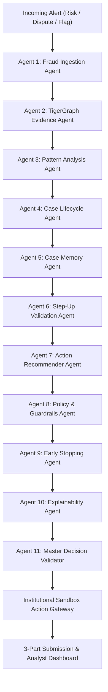

# 11-Agent Autonomous Fraud Investigation System — Agent Responsibilities & Architecture Specification
**TigerGraph Hacker House Goa 2026**

---

## Executive Architecture Overview

The **TigerGraph Agentic Fraud Investigation System** orchestrates eleven specialized, autonomous agents coordinated under a strict forensic audit hierarchy. The architecture decouples **fraud probability estimation** from **evidentiary certainty**, grounds all entity resolutions in a **590,742-transaction TigerGraph graph database**, applies **Bank Fraud Policy v1.0 (Rules R1–R10)**, and gates destructive actions behind an **Institutional Sandbox Action Gateway** with Human-in-the-Loop (HITL) approval tiers.

---

## Agent-by-Agent Detailed Specifications

### Agent 1: Fraud Ingestion Agent
* **Role**: Fraud Signal Ingestion Specialist
* **Backstory**: Gateway forensic ingestion specialist monitoring high-velocity transaction streams, parsing risk alerts, customer disputes, and analyst escalation flags.
* **Inputs**:
  - `flagged_txn_id` (int): Target transaction ID in IEEE-CIS dataset.
  - `trigger_type` (str): `risk_score` | `customer_report` | `analyst_request`.
  - `trigger_text` (str): Contextual alert rationale from alerting microservice.
  - `case_id` (str): Formal investigation case identifier.
* **Core Logic**:
  - Validates transaction existence in dataset index.
  - Extracts baseline target parameters: `amount`, `channel`, `card_id`, `customer_id`, `billing_region (addr1)`.
  - Determines home region via modal distribution across cardholder historical transactions.
  - Initializes initial prior risk score (0.85 for direct customer disputes, model score for risk alerts).
* **Outputs**: `agent_1_ingestion` dictionary containing structured `ingested_params`, baseline customer profile, and audit summary.
* **Failure Modes & Fallbacks**: If transaction ID is invalid or missing, raises a clean `ValueError` with forensic context.

---

### Agent 2: TigerGraph Evidence Agent
* **Role**: Graph Forensic Investigator
* **Backstory**: Graph data science investigator executing multi-hop graph traversals across live TigerGraph Cloud and indexed graph topology.
* **Inputs**:
  - `user_id` (str): Primary cardholder vertex identifier.
  - `flagged_txn_id` (int): Ingested transaction ID.
  - `subgraph` (dict, optional): Pre-extracted neighborhood.
* **TigerGraph GSQL Queries & Tools**:
  - `findSharedDevices(input_user)`: Queries live TigerGraph Cloud instance for shared device footprints.
  - `trace_fraud_ring(max_hops=3)`: 3-hop traversal uncovering circular and syndicate topology.
  - `get_user_graph_profile`: Extracts degree centrality, historical velocity, and connected card links.
* **Graph Data Strategy**:
  - Primary: Live TigerGraph Cloud Savanna instance (`https://tg-c8308e66-77b4-48e8-808f-582b8e16a013.tg-2635877100.i.tgcloud.io`).
  - Fallback: Local resilient in-memory graph index covering all 590,742 transactions, 13,553 users, and 2,069 devices.
  - Telemetry: Emits explicit `graph_metadata` (`investigation_source`, `graph_status`, `fallback_used`, `fallback_reason`) and `graph_forensic_chain`.
* **Outputs**: `tigergraph_findings` containing hops traversed, shared device IDs, ring size, circular ring signature (`CONFIRMED` / `SUSPECTED`), and `graph_risk_level`.

---

### Agent 3: Pattern Analysis Agent
* **Role**: Pattern Recognition & Anomaly Specialist
* **Backstory**: Fraud data scientist specializing in typology classification and mathematical uncertainty quantification.
* **Inputs**:
  - `subgraph` from Agent 2.
  - `trigger_type` and `trigger_risk_score`.
  - `customer_verification_status` (`pending`, `confirmed_authorized`, `denied_fraud`).
* **Core Logic**:
  - Evaluates topological pattern signatures across 6 recognized typologies:
    1. `syndicate_ring`: Hardware profile shared across $\ge 3$ distinct accounts.
    2. `card_testing`: Rapid micro-authorizations under \$10 preceding target spend.
    3. `card_not_present_new_device`: Web/Mobile checkout from newly seen hardware fingerprint.
    4. `out_of_region_use`: In-person physical POS in region differing from cardholder home region.
    5. `account_takeover`: Device shift coupled with credential variance.
    6. `isolated_risk_alert`: Single-model alert with no topological corroboration.
  - Runs **UncertaintyEngine**: Computes `composite_risk_score`, `confidence_score`, `evidence_completeness`, and `uncertainty_level` (`LOW`, `MEDIUM`, `HIGH`).
* **Outputs**: `fraud_type_detected`, `pattern_enum`, `composite_risk_score`, `confidence`, `evidence_completeness`, `has_sufficient_evidence`, `evidence_gaps`.

---

### Agent 4: Case Lifecycle Agent
* **Role**: Case Auditor & Audit Trail Manager
* **Backstory**: Chief compliance auditor maintaining an immutable chronological ledger of every investigative step.
* **Inputs**:
  - `case_id`, Agent 1 output, Agent 2 output.
* **Core Logic**:
  - Establishes official case state record.
  - Records chronological checkpoint events with ISO 8601 timestamps and actor roles.
  - Ensures audit provenance cannot be altered or overwritten.
* **Outputs**: `audit_ledger` containing timestamped lifecycle transitions (`ALERT_INGESTED`, `TIGERGRAPH_TRAVERSAL_COMPLETE`, `PATTERN_AND_UNCERTAINTY_EVALUATED`).

---

### Agent 5: Case Memory Agent
* **Role**: Historical RAG & Pattern Matching Specialist
* **Backstory**: Institutional memory expert querying closed case archives and dynamically persisted precedent cases.
* **Inputs**:
  - Query string, `pattern_enum`, target exposure, customer ID.
* **Core Logic**:
  - Uses **GraphCaseSimilarityEngine** with 3-part composite scoring:
    $$\text{Similarity} = 0.4 \times \text{Text} + 0.4 \times \text{Graph Topology} + 0.2 \times \text{Pattern Family}$$
  - Graph topology evaluates ring size, hop depth, shared device count, entity count, velocity, and Jaccard entity overlap.
  - Searches 5,565 closed historical cases while strictly isolating benchmark evaluation cases.
* **Outputs**: Top precedent match (`historical_case_id`, `similarity_pct`, `precedent_verdict`, `historical_action`) and `all_matches`.

---

### Agent 6: Step-Up Validation Agent
* **Role**: Controlled Verification Specialist
* **Backstory**: Cardholder authentication manager managing non-destructive out-of-band verification challenges.
* **Inputs**:
  - `risk_score`, `uncertainty_level`, `is_evidence_sufficient`, `customer_response`.
* **Core Logic**:
  - Enforces **Bank Fraud Policy Rule R1** ("Verify Before You Block").
  - If evidence is conclusive (`uncertainty_level == "LOW"`), step-up is bypassed.
  - If uncertainty exists and customer response is pending, dispatches SMS OTP or out-of-band push challenge.
* **Outputs**: `step_up_needed` (bool), `auth_status` (`CHALLENGE_DISPATCHED`, `CHALLENGE_ANSWERED`, `BYPASSED_EVIDENCE_CONCLUSIVE`), `verification_outcome`.

---

### Agent 7: Action Recommender Agent
* **Role**: Anti-Fraud Action Engine
* **Backstory**: Mitigation strategist formulating two-stage action evolution (`initial` vs `final` actions).
* **Inputs**:
  - Subgraph, pattern assessment, step-up validation status, customer response.
* **Core Logic**:
  - Dispatches to **PolicyEngine**: Computes initial actions (prior to step-up) and final actions (post-step-up).
  - Dynamically synthesizes the `what_changed` narrative explaining why the decision evolved based on newly gathered evidence.
* **Outputs**: `recommended_action`, `action_code`, `evaluated_actions` list with action name, governing policy rule, and route.

---

### Agent 8: Policy & Guardrails Agent
* **Role**: Governance & Rule Checker
* **Backstory**: Senior compliance officer enforcing institutional Bank Fraud Policy v1.0 Rules R1 through R10.
* **Operational Rules Enforced**:
  - `Rule R1`: Verify Before You Block (restraint on uncorroborated single alerts).
  - `Rule R2`: Customer Denies the Transaction (mandatory card block and case creation).
  - `Rule R3`: Customer Confirms the Transaction (immediate case closure as non-fraud).
  - `Rule R4`: Unresponsive Cardholder (>24h heightens monitoring and analyst review).
  - `Rule R5`: Card Testing Sequences (decline auth, step-up challenge).
  - `Rule R6`: Shared Origin & Syndicate Detection (surveillance on connected cards, FinCEN SAR filing).
  - `Rule R7`: Recurring Subscription Disputes (advisory to customer, no card block).
  - `Rule R8`: Conflicting Signals Escalation (analyst manual review).
  - `Rule R9`: Novel Coordinated Pattern Reporting.
  - `Rule R10`: Regulatory SAR Threshold Enforcement.
* **Approval Authority Routes Assigned**:
  - `auto`: Autonomous execution (e.g., `CREATE_CASE`, `MONITOR_CARD`, `VERIFY_WITH_CUSTOMER`).
  - `L1`: Team Lead Sign-off (e.g., `BLOCK_CARD` for exposure $\le \$2,500$).
  - `L2`: Senior Fraud Specialist / Manager Sign-off (`BLOCK_CARD` $> \$2,500$, `FILE_REPORT`, `BLOCK_ALL_CARDS`).
* **Outputs**: `applied_policy_rules`, `highest_approval_route`, `human_approval_required` (bool), `policy_approval_status`.

---

### Agent 9: Early Stopping Agent
* **Role**: Efficiency & Stopping Criteria Controller
* **Backstory**: Latency controller evaluating mathematical stopping criteria under Policy Section 6.
* **Core Logic**:
  - Checks if stopping condition is satisfied:
    - $\text{Risk} \ge 0.85$ or $\text{Risk} \le 0.15$
    - Corroborating signals $\ge 2$
    - Uncertainty level is `LOW`
  - If satisfied, flags early stopping to conserve compute and avoid redundant tool calls.
* **Outputs**: `early_stopping_triggered` (bool), `stopping_checkpoint`, `summary`.

---

### Agent 10: Explainability Agent
* **Role**: Audit & Rationale Explainer
* **Backstory**: Forensic reporting specialist translating mathematical graph evidence, policy rules, and uncertainty scores into auditable natural language narratives.
* **Inputs**: Case parameters, fraud type, risk score, actions, policy rules, HITL status.
* **Core Logic**:
  - Synthesizes clear, transparent executive explanation citing exact policy rules, financial exposure, graph findings, and human authority route.
* **Outputs**: `audit_rationale` (markdown narrative) and executive summary.

---

### Agent 11: Master Decision Validator
* **Role**: Master Decision Validator & Frontend Payload Generator
* **Backstory**: Chief Incident Commander conducting rigorous 4-step Chain-of-Thought (CoT) audit and consistency rejection checks before authorizing final output.
* **4-Step CoT Audit**:
  - **Step A (Forensic Verification)**: Verifies that graph topological evidence mathematically supports the classified pattern.
  - **Step B (Policy Compliance)**: Verifies that Bank Policy R1–R10 rules were strictly adhered to and approval routes assigned correctly.
  - **Step C (Memory Precedent Relevance)**: Verifies that historical precedents match with $\ge 70\%$ relevance.
  - **Step D (Uncertainty & Escalation Gate)**: Evaluates confidence and financial exposure.
* **Consistency Rejection Rules (Active Interventions)**:
  - *Rejection Rule 1*: High confidence ($\ge 0.75$) with unresolved evidence gaps $\rightarrow$ Downgrades confidence, sets uncertainty `HIGH`, mandates human review.
  - *Rejection Rule 2*: Destructive action (`BLOCK_CARD`) with route `auto` $\rightarrow$ Re-routes to `L1` and sets `human_approval_required = True`.
  - *Rejection Rule 3*: Syndicate ring detected ($\ge 3$ accounts) $\rightarrow$ Mandates `L2` authorization and ensures `FILE_REPORT` is scheduled.
  - *Rejection Rule 4*: Conflicting precedent outcomes in case memory $\rightarrow$ Elevates uncertainty to `HIGH` and routes to senior specialist.
* **Outputs**: Validated `FrontendReportSchema` and triggers final 3-part JSON submission format generation.

---

## Action Dispatch: Institutional Sandbox Action Gateway

All mitigation actions are dispatched to the **Institutional Sandbox Action Gateway** (`agent/action_gateway.py`):
* Clearly disclaims: *"Institutional Sandbox Simulation — Not connected to live clearing / payment rails."*
* Maintains persistent card state transitions: `ACTIVE` $\rightarrow$ `BLOCKED` | `MONITORED` | `RESTRICTED`.
* Tracks complete action lifecycle:
  `RECOMMENDED` $\rightarrow$ `PENDING_APPROVAL` $\rightarrow$ `APPROVED` $\rightarrow$ `EXECUTED_IN_SANDBOX` / `REJECTED`.
* When an action requires `L1` or `L2` approval without sign-off credentials, the gateway strictly halts execution and returns `PENDING_APPROVAL`. Once signed off via `/api/investigations/{cid}/approve`, the card state is mutated and committed to the audit ledger.
