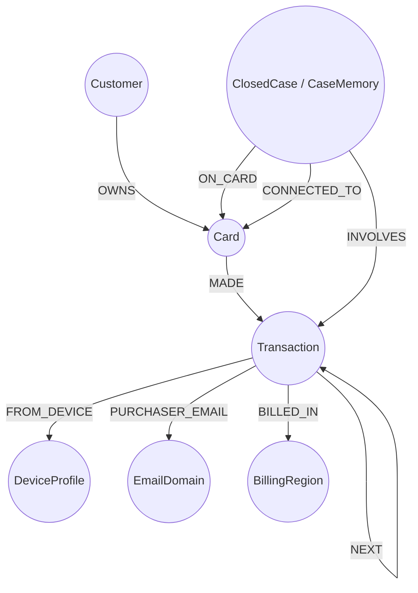

# HHGOA_IEEE Fraud Investigation Dataset Specification & Operational Notes

## 1. Executive Summary & Provenance
- **Origin**: Built on the benchmark IEEE-CIS Fraud Detection dataset originally published by Vesta Corporation.
- **Volume & Scope**: ~590,742 card transactions spanning 6 months (July 2, 2016 through December 31, 2016) across ~13,500 distinct customers (`customer_id`).
- **Core Modifications**:
  1. The binary ground-truth fraud label (`isFraud`) has been removed from raw transactions.
  2. Each transaction is augmented with a real-time `risk_score` (float [0.0, 1.0]) generated by the bank's detection model.
  3. Four key operational columns added: `customer_id`, `ts` (calendar timestamp `YYYY-MM-DD HH:MM:SS`), `channel` (`in_person` vs `online`), and `risk_score`.
  4. Real-world historical investigation records provided: 5,565 closed cases from July to October (`closed_cases_history.csv`).
  5. Held-out test evaluation set: 20 specific cases from November and December (`case_pack.csv`).
- **Anonymization & Disguise**: `TransactionID`, `card1`, `TransactionDT`, and `TransactionAmt` are masked/offset by the dataset creators to prevent lookups against public Kaggle competition files. Every entity ID used during investigation must strictly match this modified dataset.

---

## 2. File Inventory & Schemas

### 2.1 `transactions.csv` (~708 MB, 590,742 rows)
- **Primary Key**: `TransactionID`
- **Key Columns**:
  - `TransactionID`: Disguised transaction identifier (e.g., `3514030`).
  - `customer_id`: Unique customer reference derived from card issuer data (e.g., `C12382`).
  - `card1` to `card6`: Card attributes. `card4` is payment network (`visa`, `mastercard`, `discover`, `american express`), `card6` is card type (`credit`, `debit`). Card IDs follow the convention `<customer_id>-K<index>` (e.g., `C12382-K1`).
  - `ts`: Real timestamp (`YYYY-MM-DD HH:MM:SS`) spanning July 2 to December 31, 2016.
  - `TransactionAmt`: Transaction amount in USD.
  - `ProductCD`: Product code (`W`, `C`, `H`, `R`, `S`). Note: `ProductCD = 'W'` signifies in-person transactions lacking device identity records.
  - `channel`: `in_person` (for product code `W`) or `online` (for `C`, `H`, `R`, `S`).
  - `risk_score`: Continuous risk score [0.0, 1.0] from bank ML model. High scores flag review, but many high scores are false positives, while low scores can still harbor sophisticated fraud.
  - `addr1`, `addr2`: Geographic/billing region codes. `addr1` is regional billing code; `addr2` is country code (`87` denotes domestic/home country).
  - `dist1`, `dist2`: Physical/geographical distance approximations.
  - `P_emaildomain`, `R_emaildomain`: Purchaser and recipient email domains.
  - `C1` to `C14`: Vesta count features (address counts, phone associations, etc.).
  - `D1` to `D15`: Vesta delta features (time elapsed in days between activity milestones).
  - `M1` to `M9`: Match status indicators (name on card vs address match, etc.).
  - `V1` to `V339`: Engineered behavioral and graph-relationship features.

### 2.2 `identity.csv` (~26.7 MB, 144,432 rows)
- **Foreign Key**: `TransactionID` (1:1 join with `transactions.csv` for online transactions).
- **Key Columns**:
  - `id_01` to `id_11`: Numeric security ratings (device trust, IP/domain reputation, proxy ratings, session duration).
  - `id_12` to `id_38`: Categorical identity fields:
    - `id_15`: Device status (`New` vs `Found`).
    - `id_23`: Proxy categorization (`transparent`, `anonymous`, `hidden`).
    - `id_30`: Operating system (e.g., `Android 7.0`, `iOS 11.1.2`, `Windows 10`).
    - `id_31`: Browser / client software (e.g., `samsung browser 6.2`, `mobile safari 11.0`, `chrome 62.0`).
    - `id_33`: Screen resolution (e.g., `2220x1080`, `1334x750`, `1920x1080`).
    - `id_34`: Match status flag (e.g., `match_status:1`, `match_status:2`).
  - `DeviceType`: `mobile` or `desktop`.
  - `DeviceInfo`: Raw hardware/platform string (e.g., `SAMSUNG SM-G892A Build/NRD90M`, `iOS Device`, `Windows`).
- **Composite Identity Concept**:
  - `DeviceProfile` is formed by compounding: `DeviceInfo + OS + browser + screen` (e.g., `SAMSUNG SM-G892A Build/NRD90M | Android 7.0 | samsung browser 6.2 | 2220x1080`).

### 2.3 `closed_cases_history.csv` (5,565 rows)
- Serves as the **labeled ground truth history (July - October 2016)** and the initial **Case Memory**:
  - 4,665 confirmed fraud cases (`outcome = "confirmed_fraud"`).
  - 900 cleared cases (`outcome = "cleared"`).
- **Columns**:
  - `case_id`: e.g., `CC-0001`.
  - `customer_id`: Impacted customer.
  - `card_id`: Primary card under investigation.
  - `opened_at`, `closed_at`: Lifecycle timestamps.
  - `outcome`: `confirmed_fraud` or `cleared`.
  - `pattern`: One of the 5 known patterns, or `undocumented` (for confirmed fraud without clear typology), or `none` (for cleared false alarms).
  - `first_fraud_txn_id`: ID of initial fraudulent transaction.
  - `txn_ids`: Pipe-separated string of confirmed fraudulent transactions.
  - `n_txns`: Count of fraudulent transactions.
  - `exposure_usd`: Financial loss / unauthorized volume.
  - `connected_card_ids`: Additional compromised cards linked via device, IP, or merchant ring.
  - `actions_taken`: Human analyst actions executed upon case resolution.
  - `report_filed`: Boolean indicator of SAR submission.
  - `analyst_notes`: Natural language investigative rationale.

### 2.4 `case_pack.csv` (20 rows)
- The held-out benchmark cases for November and December 2016.
- **Columns**:
  - `case_id`: `HHG-001` to `HHG-020`.
  - `opened_at`: Investigation trigger timestamp.
  - `trigger_type`: One of:
    - `risk_score`: High ML score generated on `flagged_txn_id`.
    - `customer_report`: Cardholder reported unauthorized transaction or dispute.
    - `analyst_request`: Senior investigator requested cross-entity review (e.g., shared device or syndicate analysis).
  - `trigger_text`: Prompt context or customer complaint transcript.
  - `flagged_txn_id`: Transaction ID triggering the investigation.
  - `card_id`: Target card identifier.
  - `customer_id`: Target customer identifier.
  - `risk_score`: Model score on flagged transaction (empty for non-score triggers).
- **CRITICAL**: The 20 benchmark cases are eval-only. They must NEVER be loaded into case memory prior to evaluation.

---

## 3. Typologies & Fraud Patterns

### 3.1 Known Fraud Typologies
1. **Card Testing (`card_testing`)**:
   - *Signature*: Stolen card validation sequence. 3+ small authorizations (<$5 USD) online within 1 hour, followed by a larger transaction.
   - *Policy Rule*: Policy R5. Decline authorizations, enforce step-up auth, block card if large purchase already cleared.
2. **Card-Not-Present Fraud (`card_not_present_fraud`)**:
   - *Signature*: Online misuse without physical possession. Out-of-profile amounts or merchant product codes, typically clustered in bursts of 2–4 within 48 hours.
   - *Policy Rule*: Policy R1 to R4. Single transactions are ambiguous and require customer verification.
3. **Card-Not-Present via New Device (`card_not_present_new_device`)**:
   - *Signature*: Same CNP burst, but with `id_15 = 'New'` for this account, often combined with proxy flags (`id_23`). Stronger indicator than pattern 2, but still necessitates checking for legitimate hardware upgrades.
4. **Out-of-Region Use (`out_of_region_use`)**:
   - *Signature*: Physical (`in_person` / `ProductCD = 'W'`) card-present transactions in a novel `addr1` region while home region activity concurrently persists. (Continuous multi-day activity in a new region without home activity indicates legitimate travel, not a clone). Policy R2, R3.
5. **Account Takeover (`account_takeover`)**:
   - *Signature*: Mixed-channel anomalies, sudden device profile switches, failed match flags (`M1-M9`), pointing toward compromised digital banking credentials.
6. **Undocumented Patterns (`undocumented`)**:
   - *Signature*: Coordinated abuse, mule accounts, multi-customer device sharing, or merchant velocity rings that deviate from the five canonical patterns.
   - *Requirement*: Must provide a 2-3 sentence explicit description in `pattern_description` detailing what the pattern is, who it affects, and how it was discovered.
7. **Legitimate / Cleared (`none`)**:
   - *Signature*: False alerts, verified legitimate travel, recurring subscription disputes, or cardholder confirmation.

---

## 4. Bank Fraud Policy & Governance Rules (v1.0)

### 4.1 Permitted Actions & Definitions
| Action Identifier | Functional Description | Customer Impact |
| :--- | :--- | :--- |
| `ALLOW_TRANSACTION` | Authorize flagged transaction to stand | None |
| `DECLINE_TRANSACTION` | Decline flagged authorization only; card remains active | Low |
| `MONITOR_CARD` | Card active; heightened surveillance for 72 hours | None |
| `MONITOR_CONNECTED_CARDS` | Place peer cards linked via device, IP, or cluster on watch | None |
| `WARN_CUSTOMER` | Send informational alert / recurring charge reminder | None |
| `VERIFY_WITH_CUSTOMER` | Inquire if cardholder initiated the transaction (card remains active) | Low |
| `STEP_UP_AUTH` | Mandate OTP or 2FA confirmation before further transactions | Low |
| `BLOCK_CARD` | Permanently terminate card and trigger reissue | High |
| `BLOCK_ALL_CARDS` | Block all cards across the customer profile | Very High |
| `GENERATE_REPORT` | Compile internal investigative brief without opening a formal case | None |
| `CREATE_CASE` | Open formal internal case record, attached evidence, write to graph | None |
| `FILE_REPORT` | Formal SAR filing to regulatory authorities | None |
| `ESCALATE_TO_ANALYST` | Hand off complex case to human investigator | None |
| `CLOSE_NO_FRAUD` | Clear alert as legitimate / false alarm | None |

### 4.2 Approval Routing & Authority Matrix
| Approval Route | Authorized Role | Applicable Actions |
| :--- | :--- | :--- |
| `auto` | Agent (Autonomous) | `ALLOW_TRANSACTION`, `MONITOR_CARD`, `MONITOR_CONNECTED_CARDS`, `WARN_CUSTOMER`, `VERIFY_WITH_CUSTOMER`, `STEP_UP_AUTH`, `GENERATE_REPORT`, `CREATE_CASE`, `ESCALATE_TO_ANALYST`, `CLOSE_NO_FRAUD` |
| `L1` | Team Lead Approval | `DECLINE_TRANSACTION`; `BLOCK_CARD` when exposure ≤ $2,500 |
| `L2` | Fraud Manager Approval | `BLOCK_CARD` when exposure > $2,500; `BLOCK_ALL_CARDS` always; `FILE_REPORT` always |

*Crucial Architecture Requirement*: The agent recommends all necessary actions. It may autonomously execute only `auto` actions. `L1` and `L2` actions must be marked with their designated route and await human sign-off.

### 4.3 Explicit Policy Rules (R1 - R10)
- **R1 (Weak Signal / Single Indicator)**: If case rests on a single signal (e.g. risk score alone) and assessed $P(\text{fraud}) < 0.70$, recommend `VERIFY_WITH_CUSTOMER` or `STEP_UP_AUTH` prior to blocking. Blocking without corroboration is a policy violation.
- **R2 (Customer Denial)**: If customer denies charge, recommend `BLOCK_CARD` and `CREATE_CASE`. Recommend `FILE_REPORT` if exposure > $1,000 or case connects to a shared device/fraud ring.
- **R3 (Customer Confirmation)**: If customer verifies charge, recommend `CLOSE_NO_FRAUD`.
- **R4 (No Customer Reply in 24h)**: Recommend `MONITOR_CARD` and `DECLINE_TRANSACTION` for pending items; escalate if exposure > $500.
- **R5 (Card Testing)**: 3+ small authorizations within 1 hour followed by larger spend: recommend `DECLINE_TRANSACTION` and `STEP_UP_AUTH`. If purchase > $100 already cleared, recommend `BLOCK_CARD`.
- **R6 (Shared Origin / Syndicates)**: When multiple cards share a device profile, billing region, or recipient email during fraud: recommend `CREATE_CASE`, `FILE_REPORT`, and `MONITOR_CONNECTED_CARDS` on all linked cards.
- **R7 (Disputed Recurring)**: Customer disputes a charge matching established recurring pattern (same amount, merchant, monthly interval): recommend `CREATE_CASE`, `VERIFY_WITH_CUSTOMER`, `WARN_CUSTOMER` (do not block).
- **R8 (Uncertainty & High Exposure)**: If verdict is `uncertain` and exposure > $500, or evidence conflicts: recommend `ESCALATE_TO_ANALYST`.
- **R9 (Undocumented Patterns)**: If coordinated abuse across accounts does not fit standard typologies: recommend `CREATE_CASE`, `FILE_REPORT`, and `ESCALATE_TO_ANALYST` with narrative description.
- **R10 (Total Block Safeguard)**: Never recommend `BLOCK_ALL_CARDS` unless 2+ customer cards have confirmed fraud or master credentials are compromised.

### 4.4 Case vs. Suspicious Activity Report (SAR)
- **Case (`CREATE_CASE`)**: Internal operational record. Created whenever $P(\text{fraud}) \ge 0.30$, customer disputes, or evidence requested. Persisted into TigerGraph memory.
- **SAR (`FILE_REPORT`)**: Regulatory compliance filing. Required ONLY when fraud is confirmed/strongly suspected AND:
  1. Exposure > $1,000, OR
  2. Entity connects to shared device profile, region syndicate, or multi-card fraud ring, OR
  3. Pattern is undocumented/coordinated abuse (Rule R9).
- **SAR Narrative Standard (FinCEN compliant)**: Must be an exhaustive standalone narrative (6–12 sentences) articulating: **Who** (subjects, IDs), **What** (unauthorized transactions), **When** (timeframes), **Where** (regions, channels), **How** (mechanics/compromise), and **Why** (suspicious characteristics).

---

## 5. Answer Format Specification (`cases/<case_id>.json`)
Each evaluation case output must strictly conform to the top-level schema:

```json
{
  "case_id": "HHG-001",
  "case": {
    "status": "closed_fraud | closed_legitimate | open | escalated",
    "verdict": "fraud | legitimate | uncertain",
    "fraud_probability": 0.85,
    "pattern": "card_testing | card_not_present_fraud | card_not_present_new_device | out_of_region_use | account_takeover | undocumented | none",
    "pattern_description": "String (required if undocumented, else empty string)",
    "affected_txn_ids": ["T3514030", "..."],
    "first_suspicious_txn_id": "T3514030",
    "connected_card_ids": ["C12382-K2"],
    "connected_device_profiles": ["DeviceInfo | OS | Browser | Screen"],
    "exposure_usd": 1250.00,
    "evidence": [
      {
        "claim": "Clear factual finding",
        "source": "graph | document | customer | external",
        "ref": "query:query_name or policy section or evidence_request:id",
        "entity_ids": ["ID1", "ID2"]
      }
    ],
    "similar_prior_cases": ["CC-0141"],
    "summary": "2-6 sentence concise analyst summary",
    "written_to_graph": true,
    "graph_case_id": "CASE-2016-1205-001"
  },
  "evidence_requests": [
    {
      "type": "customer_validation | step_up_auth | analyst_info",
      "asked_after_step": 3,
      "assumed_response": "Simulated cardholder response"
    }
  ],
  "next_best_actions": {
    "initial": [
      {
        "action": "ACTION_NAME",
        "route": "auto | L1 | L2",
        "reason": "Rule citation and justification"
      }
    ],
    "final": [
      {
        "action": "ACTION_NAME",
        "route": "auto | L1 | L2",
        "reason": "Updated rule citation and justification"
      }
    ],
    "what_changed": "Explanation of recommendation evolution after evidence"
  },
  "sar": {
    "file": true,
    "reason": "Rule citation justifying filing",
    "narrative": "Standalone 6-12 sentence FinCEN narrative",
    "subjects": ["C12382", "C12382-K1"],
    "total_amount_usd": 1250.00,
    "activity_dates": ["2016-12-04", "2016-12-05"]
  },
  "stop_reason": "Criteria triggering termination",
  "tool_calls": 8,
  "tokens": 11500,
  "latency_s": 14.2
}
```

---

## 6. Graph Schema Design Requirements



### Graph Components:
- **Vertices**:
  - `Customer`: `customer_id` (PRIMARY_ID STRING)
  - `Card`: `card_id` (PRIMARY_ID STRING), `card_network` STRING, `card_type` STRING
  - `Transaction`: `txn_id` (PRIMARY_ID STRING), `amount` DOUBLE, `ts` DATETIME/STRING, `channel` STRING, `risk_score` DOUBLE, `product_cd` STRING
  - `DeviceProfile`: `profile_id` (PRIMARY_ID STRING: `device_info|os|browser|screen`), `device_type` STRING, `is_new` BOOL, `proxy_rating` STRING
  - `EmailDomain`: `domain` (PRIMARY_ID STRING)
  - `BillingRegion`: `region_id` (PRIMARY_ID STRING from `addr1`), `country` STRING from `addr2`
  - `ClosedCase`: `case_id` (PRIMARY_ID STRING), `opened_at` STRING, `closed_at` STRING, `outcome` STRING, `pattern` STRING, `exposure_usd` DOUBLE, `summary` STRING, `analyst_notes` STRING
- **Edges**:
  - `OWNS`: `Customer` -> `Card`
  - `MADE`: `Card` -> `Transaction`
  - `FROM_DEVICE`: `Transaction` -> `DeviceProfile`
  - `PURCHASER_EMAIL`: `Transaction` -> `EmailDomain`
  - `BILLED_IN`: `Transaction` -> `BillingRegion`
  - `NEXT`: `Transaction` -> `Transaction` (ordered by timestamp)
  - `INVOLVES`: `ClosedCase` -> `Transaction`
  - `ON_CARD`: `ClosedCase` -> `Card`
  - `CONNECTED_TO`: `ClosedCase` -> `Card`
