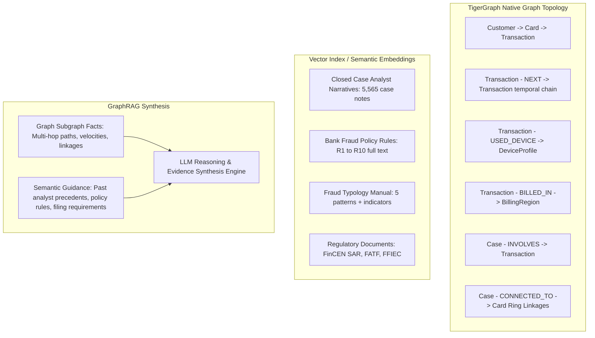

# Architecture Decision: Vector Index vs. Pure Graph Structure

In an agentic fraud investigation system, high performance and explainability require a clean separation between **relational graph topology** and **unstructured semantic vector knowledge**. TigerGraph is leveraged for what graphs excel at—exact multi-hop traversals, temporal sequences, and ring detection—while vector embeddings ground the LLM in historical case narratives, regulatory standards, and bank policies.

---

## 1. Architectural Division of Labor

---

## 2. What Belongs in the Pure Graph Structure

### 2.1 Vertices & Hard Attributes
- `Customer`: `customer_id` (PRIMARY_ID), account creation date, aggregate risk indicators.
- `Account`: `account_id`, link to customer and cards.
- `Card`: `card_id` (PRIMARY_ID), `card1`..`card6`, `card_network` (`visa`, `mastercard`, etc.), `card_type` (`debit`, `credit`).
- `Transaction`: `txn_id` (PRIMARY_ID), `amount` (DOUBLE), `ts` (DATETIME), `channel` (`in_person`, `online`), `product_cd`, `risk_score` (DOUBLE), `addr1` (region), `addr2` (country), match flags (`M1`-`M9`).
- `Device` / `DeviceProfile`: `device_id` (PRIMARY_ID), `device_info`, `device_type`, `os` (`id_30`), `browser` (`id_31`), `screen` (`id_33`), `is_new` (BOOL from `id_15`), `proxy_rating` (`id_23`).
- `IPAddress` / Proxy: `ip_id`, proxy classification (`transparent`, `anonymous`, `hidden`).
- `Merchant` / Category: `merchant_id` derived from product codes and recipient domain.
- `EmailDomain`: `domain` (PRIMARY_ID) for purchaser and recipient domains.
- `BillingRegion`: `region_id` (PRIMARY_ID from `addr1`), `country_code` (`addr2`).
- `Case`: `case_id` (PRIMARY_ID), `status`, `verdict`, `fraud_probability`, `pattern`, `exposure_usd`, `opened_at`, `closed_at`, `report_filed`.
- `Evidence`: `evidence_id`, `claim`, `source`, `ref`.
- `Policy`: `rule_id` (PRIMARY_ID: `R1` to `R10`), `rule_name`, `approval_route`, `min_exposure`.

### 2.2 Edges & Traversals
- `OWNS`: `Customer` $\rightarrow$ `Card`
- `PERFORMED` / `MADE`: `Card` $\rightarrow$ `Transaction`
- `USED_DEVICE`: `Transaction` $\rightarrow$ `Device`
- `BILLED_IN`: `Transaction` $\rightarrow$ `BillingRegion`
- `PURCHASER_EMAIL`: `Transaction` $\rightarrow$ `EmailDomain`
- `RECIPIENT_EMAIL`: `Transaction` $\rightarrow$ `EmailDomain`
- `PROCESSED_BY`: `Transaction` $\rightarrow$ `Merchant`
- `NEXT`: `Transaction` $\rightarrow$ `Transaction` (Ordered chronologically per card; essential for velocity and testing sequences)
- `INVOLVES`: `Case` $\rightarrow$ `Transaction`
- `ON_CARD`: `Case` $\rightarrow$ `Card`
- `CONNECTED_TO`: `Case` $\rightarrow$ `Card` (Multi-card compromise links)
- `HAS_EVIDENCE`: `Case` $\rightarrow$ `Evidence`
- `GOVERNED_BY`: `Case` $\rightarrow$ `Policy`
- `SIMILAR_TO`: `Case` $\rightarrow$ `Case`

### 2.3 Graph Capabilities Leveraged
1. **Card Testing Velocity**: Traversing `Transaction -NEXT-> Transaction` within a 1-hour window to identify $\ge 3$ micro transactions followed by a major purchase.
2. **Device Sharing & Ring Detection**: Querying 2-hop neighbors `Card -> Transaction -> Device <- Transaction <- Card` to find syndicates exploiting multiple cards on a single machine.
3. **Out-of-Region Geo-Velocity**: Traversing `Transaction -> BillingRegion` to detect card-present purchases in novel regions while domestic activity continues.
4. **Graph Subgraph Serialization**: Extracting localized connected subgraphs to present compact, structured JSON evidence to the LLM.

---

## 3. What Belongs in the Vector Index (Semantic Embeddings)

Vector search is reserved for dense natural language corpora where keywords or graph hops alone are insufficient to capture contextual intent, nuanced precedent, or regulatory wording.

### 3.1 Unstructured Documents in Vector Store
1. **Closed Case Analyst Narratives (`closed_cases_history.csv`)**:
   - `5,565` rich text notes written by senior investigators explaining why an ambiguous scenario was cleared as legitimate or confirmed as fraud.
   - Enables semantic retrieval of precedents: *"Retrieve past cases where cardholder claimed fraud on an out-of-region POS charge but had regular domestic activity."*
2. **Bank Fraud Policy (Rules R1 – R10)**:
   - Full semantic text of all 10 policy rules, detailing edge cases, customer validation rules, when not to block all cards, and approval authorities.
   - Grounding the LLM: Ensures rule citations (`R1`, `R2`, `R5`, etc.) in the final case output and SAR accurately mirror policy text.
3. **Documented & Undocumented Fraud Typology Guides**:
   - In-depth descriptions of the 5 canonical patterns plus observed real-world evasion tactics.
4. **Regulatory Guidelines**:
   - **FinCEN SAR Guidance**: Guidance on constructing defensible narratives answering Who, What, When, Where, How, and Why.
   - **FATF Cyber-Enabled Fraud & Money Laundering Typologies**: Complex fraud topologies and money mule indicators.
   - **FFIEC Examination Manual Red Flags**: Behavioral anomaly red flags.

---

## 4. Synergy in GraphRAG Loop

1. **Trigger fires**: The agent receives a case trigger (`risk_score`, `customer_report`, or `analyst_request`).
2. **Graph Retrieval**:
   - Executes GSQL queries to gather transaction history, recent velocities, `NEXT` sequence, device profile, and connected card neighbors.
   - Formulates a hard structural evidence summary.
3. **Vector Retrieval**:
   - Embeds the case summary and structural findings.
   - Searches the vector store for the top-3 most similar closed cases (`similar_prior_cases`) and relevant policy clauses.
4. **Context Fusion**:
   - Combines structural graph facts + retrieved precedents + relevant policy rules into a clean context prompt for the LLM.
5. **Reasoning & Action**:
   - The LLM reasons over the grounded context, calibrates uncertainty, determines whether customer validation is required, and outputs policy-compliant next best actions.
